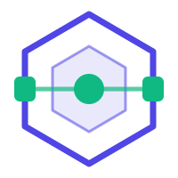

<div align="center">


# knowledgeSupport API

### Smart knowledge base for technical support

**Jira tickets + solution standards = increasingly automatic answers**

[](https://github.com/fkauanGIT/knowledgeSupport-api/releases)
[](https://openjdk.org/projects/jdk/17/)
[](https://spring.io/projects/spring-boot)
[](https://www.postgresql.org/)
[](docs/ARCHITECTURE.md)

</div>

---

**knowledgeSupport** integrates **Jira** tickets, keeps a catalog of **error patterns and solutions** (Standards), and already cross-references every ticket against the registered patterns to suggest a solution — on the roadmap, it will answer directly via **Chatwoot**. Every time a Standard is registered, the system "learns": the same error never has to be solved twice.

Built with **Java 17 + Spring Boot** using **Hexagonal Architecture** (Ports & Adapters).

## 📚 Documentation

| Document | What's in it |
|---|---|
| [docs/ARCHITECTURE.md](docs/ARCHITECTURE.md) | The project's hexagonal architecture: layers, ports, adapters, diagrams, flows and decisions |
| [docs/FOLDER_STRUCTURE.md](docs/FOLDER_STRUCTURE.md) | Annotated map of the folders + "where to put what" + naming conventions |
| [CONTRIBUTING.md](CONTRIBUTING.md) | Commit convention and automatic versioning (Release Please) |
| [CHANGELOG.md](CHANGELOG.md) | Version history (auto-generated) |

## 🚀 How to run

**Requirements:** Java 17, Docker (for local PostgreSQL).

```bash
# 1. Configuration: copy the template and fill it in (Jira token, etc.)
cp .env.example .env

# 2. Start the local database
docker compose up -d

# 3. Run the application (Spring reads the .env on its own)
./mvnw spring-boot:run
```

> `.env` is never committed (it's in `.gitignore`). To use an external Postgres
> (e.g. Supabase), just swap the `DB_*` variables in `.env` — no code changes needed.

## 🔌 API

The API documentation is **generated automatically** (springdoc/OpenAPI) and served by the application itself — always up to date, with examples and interactive execution ("Try it out"):

| Address (with the app running) | What it is |
|---|---|
| [`/swagger-ui.html`](http://localhost:8080/swagger-ui.html) | 📖 Interactive API documentation (Swagger UI) |
| [`/v3/api-docs`](http://localhost:8080/v3/api-docs) | OpenAPI 3 spec in JSON (importable into Postman/Insomnia) |
| [`/actuator/info`](http://localhost:8080/actuator/info) | Build version and commit |
| [`/actuator/health`](http://localhost:8080/actuator/health) | Application health |

In short: `/api/standards` (knowledge base CRUD), `/api/calleds` (live, read-only Jira tickets) and `/api/calleds/{key}/analysis` (cross-references a ticket against the Standards by routine + error name and returns the solution, if found). Details for each route, field and example: in Swagger.

## 🧭 The architecture in 30 seconds

```
HTTP client ─▶ adapter/in/web ─▶ port/in ─▶ application/service ─▶ port/out ─▶ adapter/out ─▶ Postgres / Jira
                (Controllers)   (UseCases)   (business rules)      (contracts)  (JPA / RestClient)
```

- The **core** (`domain` + `application`) knows nothing about HTTP, SQL or Jira.
- **Ports** are interfaces: the core declares what it offers (`port/in`) and what it needs (`port/out`).
- **Adapters** translate each boundary and are swappable without touching the core.

Details, diagrams and the reasoning behind each decision: [docs/ARCHITECTURE.md](docs/ARCHITECTURE.md).

## 🤝 Contributing

1. Read [docs/ARCHITECTURE.md](docs/ARCHITECTURE.md) and [docs/FOLDER_STRUCTURE.md](docs/FOLDER_STRUCTURE.md).
2. Follow Conventional Commits (`feat:`, `fix:`, `chore:` — see [CONTRIBUTING.md](CONTRIBUTING.md)).
3. Versioning is automatic: `feat`/`fix` on `main` feed the bot's Release PR; merging it publishes the release.

## 🗺️ Roadmap

- [x] Standards CRUD (PostgreSQL)
- [x] Read integration with Jira (`Called`)
- [x] Automatic versioning (Release Please + Actuator)
- [x] Structured routine and error name (Jira custom fields) on tickets and standards
- [x] `AnalyzeCalledUseCase` — suggest a solution by cross-referencing ticket × standards (routine + error name + filled-in solution)
- [ ] Chatwoot integration (inbound webhook + automatic reply)
- [ ] Web management interface
