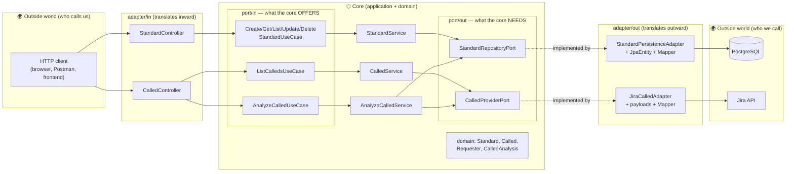
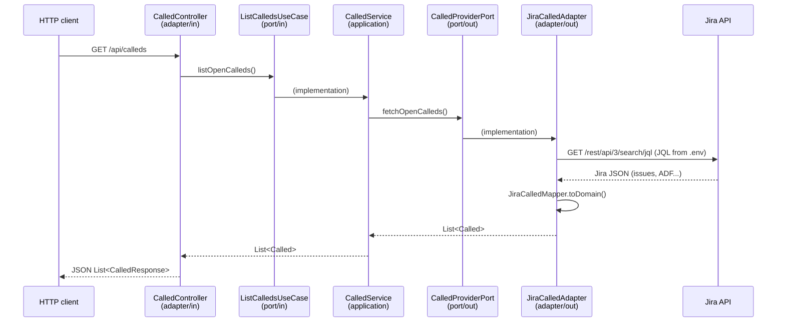
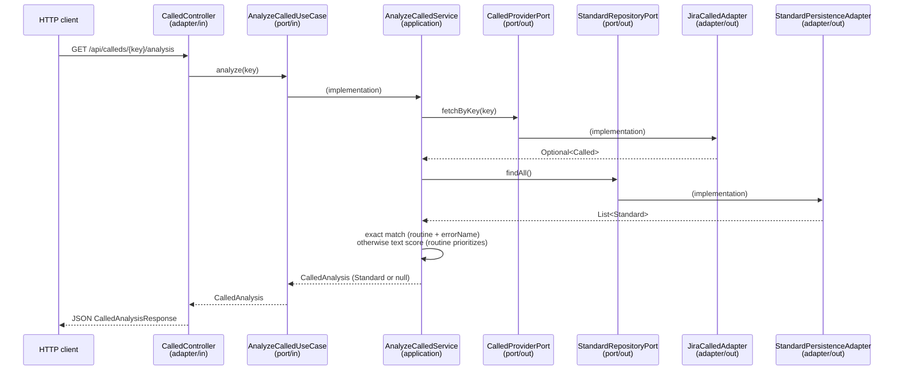

# knowledgeSupport-api Architecture

> Architecture guide for anyone contributing to, studying, or evolving the project.
> Read it together with [FOLDER_STRUCTURE.md](FOLDER_STRUCTURE.md).

## What the system does

**knowledgeSupport** is a technical support knowledge base. The core idea:

1. Tickets (`Called`) come from outside — today, pulled from the **Jira** API (project SUP).
2. Error patterns (`Standard`) are registered and persisted in **PostgreSQL** — each one describes a known error and its solution.
3. The system **compares** the ticket against the registered patterns (routine + error name) and automatically returns the solution when it finds a Standard with a filled-in solution. The more patterns registered, the more the system "learns".
4. (Roadmap) **Chatwoot** integration to receive conversations and reply to the requester.

## Why Hexagonal Architecture?

The project uses **Hexagonal Architecture** (Ports & Adapters). The principle in one sentence:

> **The business rules at the center don't know HOW the outside world talks to them, nor WHERE the data is stored.**

This is achieved with two language tools:

- **Interfaces (ports)** — contracts the core declares ("I need someone to save this" / "I offer the ability to create a Standard").
- **Dependency injection (Spring)** — who fulfills each contract is decided outside the core, at startup.

The practical payoff: swapping Jira for another system, Postgres for another database, or REST for another channel **never touches the core** — you create/swap an adapter.

## The project's hexagon



**How to read it:** solid arrows = call flow; dotted arrows = "who implements the contract". Notice that both output adapters point **inward** (they implement interfaces owned by the core) — that's the **dependency inversion** that protects the core.

## The three layers

### 1. `domain` — the business vocabulary

Classes representing support concepts: `Standard` (error pattern + solution), `Called` (support ticket), `Requester` (the person who opened the ticket) and the enums (`IncidentType`, `FilterCategory`, ...). **Pure Java**: no Spring, no JPA, no JSON. If a support analyst wouldn't recognize the word, it doesn't belong in this layer.

### 2. `application` — the rules and the contracts

- **`port/in`** — interfaces with the use cases the system **offers** (`CreateStandardUseCase`, `ListCalledsUseCase`, `AnalyzeCalledUseCase`...). Called by: inbound adapters. Implemented by: services.
- **`port/out`** — interfaces with what the system **needs from the outside** (`StandardRepositoryPort`, `CalledProviderPort`). Called by: services. Implemented by: outbound adapters.
- **`service`** — the actual logic (`StandardService`, `CalledService`, `AnalyzeCalledService`). Orchestrates domain and ports. Also knows nothing about technology: no imports of web, JPA or HTTP client.

### 3. `adapter` — the boundary translators

All code that speaks an external "language" (HTTP, SQL, the Jira API) lives here:

- **`adapter/in/web`** — REST channel: controllers + `*Request`/`*Response` records (**our** JSON format).
- **`adapter/out/persistence`** — database channel: `StandardJpaEntity` (table format), `StandardJpaRepository` (Spring Data) and `StandardMapper`.
- **`adapter/out/jira`** — Jira channel: `JiraCalledAdapter` (REST client), `Jira*` records (**their** JSON format, including ADF) and `JiraCalledMapper`.

## The dependency rule (the one non-negotiable rule)

```
adapter  ──may import──▶  application  ──may import──▶  domain
domain      imports nothing from the project
application imports nothing from adapter (nor from any infra framework)
```

In practice, the test is simple: **open the file's imports.** A service with `import jakarta.persistence...` or a domain class with `import com.fasterxml.jackson...` is violating the architecture.

## Why does every concept have "three versions"?

`Standard` exists as `StandardRequest`/`StandardResponse` (web boundary), `Standard` (domain) and `StandardJpaEntity` (database boundary). It looks like duplication, but each version belongs to a world with its own reasons to change: the API's JSON can change without breaking the database table, and vice versa. The **mappers** at the boundaries do the translation — external formats "die" inside the adapter and never circulate through the core.

The same applies to `Called`: Jira's giant JSON (40+ fields, tree-shaped ADF description) becomes a clean `Called` inside `JiraCalledMapper`, and the rest of the system never sees a raw Jira field.

## Real flows

### GET /api/calleds (fetch tickets from Jira)



### GET /api/calleds/{key}/analysis (analyze a ticket)



The only flow in the system that depends on **two** output ports at once — which is why `AnalyzeCalledService` is the only service that receives `CalledProviderPort` and `StandardRepositoryPort` together in its constructor.

### POST /api/standards (register a pattern)

```
Client ▶ StandardController (StandardRequest → Standard)
       ▶ CreateStandardUseCase ▶ StandardService
       ▶ StandardRepositoryPort ▶ StandardPersistenceAdapter
         (Standard → StandardJpaEntity via StandardMapper) ▶ PostgreSQL
```

## Architecture decisions (and their reasons)

| Decision | Reason |
|---|---|
| `Called` is **never persisted** | Jira is the source of truth for tickets. Every `GET /api/calleds` queries Jira live — no sync, no stale data. |
| `Requester` has no dedicated slice | It lives **inside** `Called` (part of the aggregate). It would only earn its own repository/controller if the business needed to manage it in isolation. |
| `CalledController` only has GET | Tickets are born in Jira, not in our API. |
| External formats stay in the adapters | Jira JSON, ADF, JPA entities: none of that crosses a port. |
| Sensitive config via `.env` | Jira token and database credentials never go into git (`.gitignore`). Spring reads the file via `spring.config.import`. |
| Configurable JQL (`JIRA_JQL`) | Changing the ticket filter is configuration, not code. |
| Only WINTHOR tickets come in | Filtered by Request Type in the JQL (`.env`) — the product's scope is configuration, not code. |
| Matching by *containment score* (not symmetric Jaccard), `routineNumber` becomes a filter | Exact equality on `errorName` (kept as the first, cheapest and 100% explainable step) rarely matches when the "error" is a natural-language investigation. `titleCalled`+`descriptionCalled`+`errorName` now enter the comparison against `standardName`+`text`; `routineNumber` stopped being a mandatory pair and became a filter that only prioritizes candidates. The score is **asymmetric on purpose**: `intersection / ticket tokens`, not `intersection / union` — symmetric Jaccard penalized rich Standards (long text, accumulating several symptom variations), which is exactly the behavior we want to encourage over time. A minimum guard of 3 ticket tokens avoids inflated containment from matching a handful of generic words. Score and threshold (`matching.threshold`) are made explicit both in the domain (`MatchMethod`) and in config. |
| Typo tolerance via Apache Commons Text | A typo in one word shouldn't zero out a match that would be obvious to a human. The only documented exception to the "no new dependency without justification" rule (see `BACKLOG.md`, item 1.3). |
| `Standard.text`/`result` without the 255-character limit (`@Column(columnDefinition = "text")`) | JPA defaults to `varchar(255)` when the column isn't annotated. That was blocking the very enrichment flow encouraged above — a Standard that accumulates symptoms needs long text. Discovered by testing manual registration; `ddl-auto: update` doesn't alter an existing column, so an `ALTER TABLE` had to be run once on the database. |
| `JiraCalledMapper` strips the log timestamp from the start of `errorName` | Rejection responses (e.g. SEFAZ) come from Jira as `"dd/MM/yyyy HH:mm:ss - Sefaz response: ..."`. The timestamp never repeats between tickets — left in the text, it inflates the containment score's denominator for nothing and prevents even the exact match (1.1) from working, even for 100% deterministic errors. External format, dies in the adapter, like everything else. |
| `CalledStandardMatcher` extracted from `AnalyzeCalledService` | `GapReportService` needs to run the same cascade in bulk over every open ticket. If each one called `AnalyzeCalledUseCase.analyze(jiraKey)`, it would be N+1: re-fetching the Called (already in hand) and re-fetching `findAll()` of the Standards on every iteration. The pure class receives an already-loaded `Called` + `List<Standard>`; each service fetches once. |
| Central `GlobalExceptionHandler` (`@RestControllerAdvice`) | `NoSuchElementException` becoming a 404 used to be handled case by case (`CalledController` didn't handle it at all, `StandardController` duplicated the same catch across three methods). One handler per domain exception type, a standardized error body (`timestamp/status/error/message`) across the whole API. |
| Feedback references `standardId` as a bare UUID, without a JPA `@ManyToOne` | `FeedbackJpaEntity` doesn't need to load the `Standard` graph to exist — keeps the feedback table decoupled and the aggregation query simple. Consistent with the rest of the domain, which treats relationships between aggregates by id, not by a persisted object reference. |
| `Called`/`Standard` use a builder, no setters | A positional constructor with 10+ parameters of the same type (`String, String, String, ...`) is a source of silent bugs — swapping two arguments compiles fine and throws nothing. The builder names each field at the call site. Setters were removed because nothing outside the class itself used them — checked before removing. |
| Routine and error name come structured from Jira | The JSM form has required fields (custom fields `customfield_10432`/`10433`), read by the adapter and mapped to `Called.routineNumber`/`errorName`. Regex extraction from the description is a fallback, not the primary source. |
| Automatic versioning | Conventional Commits + Release Please. See [CONTRIBUTING.md](../CONTRIBUTING.md). |
| Static API key authentication (`X-API-KEY`), not JWT | There are no users logging in today — the consumers are the Jira webhook and machine-to-machine calls. JWT exists to solve user session identity/expiration, which isn't the problem here; a shared secret key (`ApiKeyAuthFilter`, `SecurityConfig`) solves it with less code and no new dependency. Reconsider if item 2.6 (frontend with real users) ever ships. |
| `MatchMethod` carries an explicit `Confidence` (`CONFIRMED`/`LIKELY`/`UNCERTAIN`/`NONE`), not just the raw score | Clearing `matching.threshold` used to mean "return a solution" with no distinction between an exact match and a 0.41-scoring guess — both looked equally authoritative in the response. A second config value, `matching.high-confidence-threshold` (default 0.75), splits score-based matches into `LIKELY` vs `UNCERTAIN`; exact match is always `CONFIRMED`. This is a **labeling change, not a scoring change** — the containment algorithm itself is untouched, and `UNCERTAIN` still returns the candidate solution (nothing is hidden), just flagged as a guess to double-check rather than an answer to trust automatically. See `docs/LIMITATIONS.md` for what this does and doesn't fix. |

## Design patterns present

- **Ports & Adapters (Hexagonal)** — the overall structure.
- **Dependency Injection** — Spring instantiates and wires everything; nobody `new`s a dependency.
- **Repository** — `StandardRepositoryPort` abstracts persistence as a "collection".
- **Mapper** — `StandardMapper`, `JiraCalledMapper`: conversion between representations, always at the boundary.
- **DTO** — `*Request`/`*Response` and `Jira*` records: data-only objects for crossing boundaries.

## How to extend the system (recipes)

### New operation on an existing concept
1. Create the interface in `application/port/in` (e.g. `AnalyzeCalledUseCase`).
2. Implement it in the service (or create a new service).
3. Expose it in the corresponding controller.

### New outbound integration WE call (e.g. Chatwoot to send a message)
1. Create the port in `application/port/out` (e.g. `ChatMessagePort`) — signature in domain terms.
2. Create `adapter/out/chatwoot/` with the adapter (`implements ChatMessagePort`), the payload records and the mapper.
3. Configuration (URL, token) in `.env` + `application.yaml`, injected via `@Value`.

### New inbound channel (e.g. a Chatwoot webhook, a scheduler)
1. Create `adapter/in/chatwoot/` (or `adapter/in/scheduler/`).
2. The adapter receives the external stimulus, translates it to the domain and calls an existing or new use case.
3. The core doesn't change (unless the business rule itself is new).

### Golden rule when in doubt
"Who starts the conversation?" — something from outside calls the system → `in`; the system calls something outside → `out`. Direction **of the call**, not of the data: *pulling* data from Jira is `out`, because we're the ones calling them.

## Architecture roadmap

- [x] `routineNumber` field on `Standard` and `Called` — a structured signal for the matcher (routine comes from the Jira custom field).
- [x] `AnalyzeCalledUseCase` — cross-reference `Called` × `Standard` and suggest a solution (service with two output ports: `CalledProviderPort` + `StandardRepositoryPort`).
- [x] Unit tests for the core with mocked ports (Mockito), no database, no Jira, no network (`AnalyzeCalledServiceTest` and the rest of the `application/service` suite).
- [x] `jiraKey` field and status on `Called` — `CalledResponse` now exposes both; `jiraKey` unlocks going straight from `GET /api/calleds` to `/{key}/analysis`.
- [ ] `adapter/in/chatwoot` (webhook) and `adapter/out/chatwoot` (replies) — not done, no credentials configured.
- [x] More tolerant matching between `errorName`/`standardName` and the ticket text — containment score (not symmetric Jaccard, see the decision table) with Portuguese stopwords and typo tolerance (Levenshtein), `routineNumber` as a filter instead of a mandatory pair (`TextSimilarity`, `AnalyzeCalledService`, `MatchMethod`).
- [x] Treat `NoSuchElementException` as a 404 (previously bubbled up as a generic 500) — `GlobalExceptionHandler` (`@RestControllerAdvice`) centralizes this for all controllers, with a body explaining why.
- [x] Pagination (`nextPageToken`) and retry-with-backoff on 429 in `JiraCalledAdapter`.
- [x] `GapReportUseCase` (`GET /api/calleds/gap-report`) — aggregates unmatched tickets by routine, to show where registering a Standard yields the most coverage.
- [x] `SubmitFeedbackUseCase`/`GetStandardAccuracyUseCase` (`POST /api/calleds/{key}/feedback`, `GET /api/standards/{id}/accuracy`) — real "did it solve it or not" feedback becomes an auditable accuracy rate per Standard.
- [x] `Called`/`Standard` gained a builder — a positional constructor with 10+ fields was a source of silent bugs.
- [ ] Real `IncidentType`/`FilterCategory` — `IncidentType` already derives from Jira's `issuetype`; `FilterCategory` is still fixed at `SUPPORT` (no reliable signal to tell INFRASTRUCTURE/DEVELOPMENT apart yet, see `LIMITATIONS.md`).
