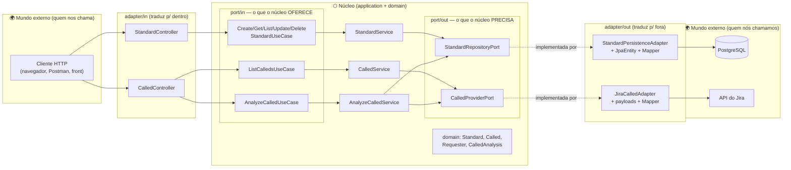
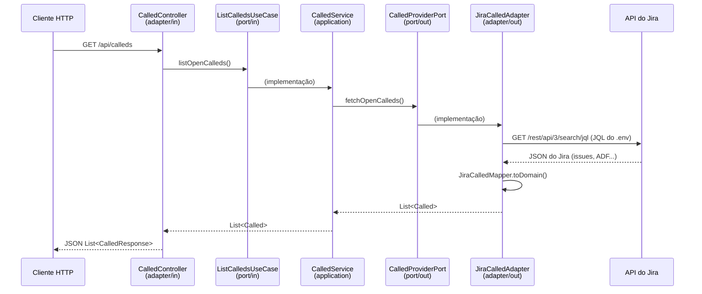
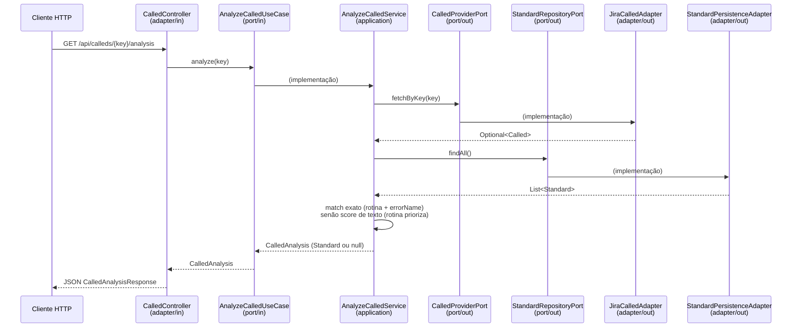

# Arquitetura do knowledgeSupport-api

> Guia de arquitetura para quem vai contribuir, estudar ou evoluir o projeto.
> Leia junto com [FOLDER_STRUCTURE.md](FOLDER_STRUCTURE.md).

## O que o sistema faz

O **knowledgeSupport** é uma base de conhecimento de suporte técnico. A ideia central:

1. Chamados (`Called`) chegam de fora — hoje, puxados da API do **Jira** (projeto SUP).
2. Padrões de erro (`Standard`) são cadastrados e persistidos no **PostgreSQL** — cada um descreve um erro conhecido e sua solução.
3. O sistema **compara** o chamado com os padrões cadastrados (rotina + nome do erro) e devolve a solução automaticamente quando encontra um Standard com solução preenchida. Quanto mais padrões cadastrados, mais o sistema "aprende".
4. (Roadmap) Integração com **Chatwoot** para receber conversas e responder o solicitante.

## Por que Arquitetura Hexagonal?

O projeto usa **Arquitetura Hexagonal** (Ports & Adapters). O princípio em uma frase:

> **As regras de negócio no centro não sabem COMO o mundo externo fala com elas, nem ONDE os dados são guardados.**

Isso se materializa em duas ferramentas da linguagem:

- **Interfaces (ports)** — contratos que o núcleo declara ("preciso de alguém que salve" / "eu ofereço criar um Standard").
- **Injeção de dependência (Spring)** — quem cumpre cada contrato é decidido fora do núcleo, na inicialização.

O ganho prático: trocar Jira por outro sistema, Postgres por outro banco, ou REST por outro canal **não toca o núcleo** — cria-se/troca-se um adapter.

## O hexágono do projeto



**Como ler:** setas cheias = fluxo de chamada; setas pontilhadas = "quem implementa o contrato". Repare que os dois adapters de saída apontam **para dentro** (implementam interfaces do núcleo) — essa é a **inversão de dependência** que protege o núcleo.

## As três camadas

### 1. `domain` — o vocabulário do negócio

Classes que representam os conceitos do suporte: `Standard` (padrão de erro + solução), `Called` (chamado), `Requester` (solicitante) e os enums (`IncidentType`, `FilterCategory`, ...). **Java puro**: sem Spring, sem JPA, sem JSON. Se um analista de suporte não reconheceria a palavra, ela não pertence a esta camada.

### 2. `application` — as regras e os contratos

- **`port/in`** — interfaces com os casos de uso que o sistema **oferece** (`CreateStandardUseCase`, `ListCalledsUseCase`, `AnalyzeCalledUseCase`...). Quem chama: adapters de entrada. Quem implementa: services.
- **`port/out`** — interfaces com o que o sistema **precisa de fora** (`StandardRepositoryPort`, `CalledProviderPort`). Quem chama: services. Quem implementa: adapters de saída.
- **`service`** — a lógica de verdade (`StandardService`, `CalledService`, `AnalyzeCalledService`). Orquestra domínio e ports. Também não conhece tecnologia: nenhum import de web, JPA ou HTTP client.

### 3. `adapter` — os tradutores de fronteira

Todo código que fala um "idioma" externo (HTTP, SQL, API do Jira) vive aqui:

- **`adapter/in/web`** — canal REST: controllers + records `*Request`/`*Response` (o formato do **nosso** JSON).
- **`adapter/out/persistence`** — canal banco: `StandardJpaEntity` (formato da tabela), `StandardJpaRepository` (Spring Data) e `StandardMapper`.
- **`adapter/out/jira`** — canal Jira: `JiraCalledAdapter` (REST client), records `Jira*` (formato do JSON **deles**, incluindo ADF) e `JiraCalledMapper`.

## A regra de dependência (a única regra inegociável)

```
adapter  ──pode importar──▶  application  ──pode importar──▶  domain
domain      não importa nada do projeto
application não importa nada de adapter (nem de framework de infra)
```

Na prática, o teste é simples: **abra os imports do arquivo.** Um service com `import jakarta.persistence...` ou um domínio com `import com.fasterxml.jackson...` está violando a arquitetura.

## Por que cada conceito tem "três versões"?

O `Standard` existe como `StandardRequest`/`StandardResponse` (fronteira web), `Standard` (domínio) e `StandardJpaEntity` (fronteira banco). Parece duplicação, mas cada versão pertence a um mundo com motivos próprios para mudar: o JSON da API pode mudar sem quebrar a tabela do banco, e vice-versa. Os **mappers** nas fronteiras fazem a tradução — formatos externos "morrem" dentro do adapter e nunca circulam pelo núcleo.

O mesmo vale para o `Called`: o JSON gigante do Jira (40+ campos, descrição em árvore ADF) vira um `Called` limpo dentro do `JiraCalledMapper`, e o resto do sistema nunca vê um campo do Jira.

## Fluxos reais

### GET /api/calleds (buscar chamados do Jira)



### GET /api/calleds/{key}/analysis (analisar um chamado)



Único fluxo do sistema que depende de **duas** ports de saída ao mesmo tempo — por isso `AnalyzeCalledService` é o único service que recebe `CalledProviderPort` e `StandardRepositoryPort` juntos no construtor.

### POST /api/standards (cadastrar um padrão)

```
Cliente ▶ StandardController (StandardRequest → Standard)
        ▶ CreateStandardUseCase ▶ StandardService
        ▶ StandardRepositoryPort ▶ StandardPersistenceAdapter
          (Standard → StandardJpaEntity via StandardMapper) ▶ PostgreSQL
```

## Decisões de arquitetura (e seus porquês)

| Decisão | Motivo |
|---|---|
| `Called` **não é persistido** | O Jira é a fonte da verdade dos chamados. Cada `GET /api/calleds` consulta o Jira ao vivo — sem sincronização, sem dado defasado. |
| `Requester` não tem fatia própria | Ele vive **dentro** do `Called` (parte do agregado). Só ganharia repository/controller se o negócio precisasse gerenciá-lo isoladamente. |
| `CalledController` só tem GET | Chamados nascem no Jira, não na nossa API. |
| Formatos externos ficam nos adapters | JSON do Jira, ADF, entidades JPA: nada disso atravessa uma port. |
| Config sensível via `.env` | Token do Jira e credenciais de banco nunca vão para o git (`.gitignore`). O Spring lê o arquivo via `spring.config.import`. |
| JQL configurável (`JIRA_JQL`) | Mudar o filtro de chamados é configuração, não código. |
| Só chamados WINTHOR entram | Filtro por Request Type na JQL (`.env`) — o escopo do produto é configuração, não código. |
| Matching por *containment score* (não Jaccard simétrico), `routineNumber` vira filtro | Igualdade exata de `errorName` (mantida como primeiro degrau, mais barato e 100% explicável) raramente bate quando o "erro" é uma investigação em linguagem natural. `titleCalled`+`descriptionCalled`+`errorName` agora entram na comparação contra `standardName`+`text`; `routineNumber` deixou de ser par obrigatório e virou um filtro que só prioriza candidatos. O score é **assimétrico de propósito**: `interseção / tokens do chamado`, não `interseção / união` — Jaccard simétrico penalizava Standards ricos (texto longo, acumulando várias variações de sintoma), que é exatamente o comportamento que queremos incentivar com o tempo. Guarda mínima de 3 tokens no chamado evita containment inflado por match de poucas palavras genéricas. Score e threshold (`matching.threshold`) ficam explícitos no domínio (`MatchMethod`) e na config. |
| Tolerância a typo via Apache Commons Text | Erro de digitação em uma palavra não pode zerar um match que seria óbvio para um humano. Única exceção documentada à regra "sem dependência nova sem justificar" (ver `BACKLOG.md`, item 1.3). |
| `Standard.text`/`result` sem limite de 255 caracteres (`@Column(columnDefinition = "text")`) | JPA usa `varchar(255)` por padrão quando a coluna não é anotada. Isso trava o próprio fluxo de enriquecimento incentivado acima — um Standard que acumula sintomas precisa de texto longo. Descoberto testando o cadastro manualmente; `ddl-auto: update` não altera coluna existente, foi preciso rodar `ALTER TABLE` uma vez no banco. |
| `JiraCalledMapper` remove timestamp de log do início do `errorName` | Respostas de rejeição (ex: SEFAZ) vêm do Jira como `"dd/MM/aaaa HH:mm:ss - Resposta da Sefaz: ..."`. O timestamp nunca se repete entre chamados — sobrando no texto, infla o denominador do containment score à toa e nunca deixa o match exato (1.1) funcionar, mesmo pra erros 100% determinísticos. Formato externo, morre no adapter, como o resto. |
| `CalledStandardMatcher` extraído do `AnalyzeCalledService` | `GapReportService` precisa rodar a mesma cascata em lote sobre todos os chamados abertos. Se cada um chamasse `AnalyzeCalledUseCase.analyze(jiraKey)`, seria N+1: re-busca o Called (já em mãos) e re-busca `findAll()` dos Standards a cada iteração. A classe pura recebe `Called` + `List<Standard>` já carregados; quem busca é cada service, uma vez só. |
| `GlobalExceptionHandler` (`@RestControllerAdvice`) central | `NoSuchElementException` virando 404 era tratado caso a caso (`CalledController` nem tratava, `StandardController` duplicava o mesmo catch em três métodos). Um handler por tipo de exceção do domínio, corpo de erro padronizado (`timestamp/status/error/message`) em toda a API. |
| Feedback referencia `standardId` por UUID solto, sem `@ManyToOne` JPA | `FeedbackJpaEntity` não precisa carregar o grafo de `Standard` pra existir — mantém a tabela de feedback desacoplada e a query de agregação simples. Consistente com o resto do domínio, que trata relação entre agregados por id, não por referência de objeto persistido. |
| `Called`/`Standard` com builder, sem setters | Construtor posicional de 10+ parâmetros do mesmo tipo (`String, String, String, ...`) é fonte de bug silencioso — trocar dois argumentos de lugar compila e não dá erro nenhum. Builder nomeia cada campo no call site. Setters removidos porque nada fora da própria classe os usava — checado antes de tirar. |
| Rotina e nome do erro vêm estruturados do Jira | O formulário do JSM tem campos obrigatórios (custom fields `customfield_10432`/`10433`), lidos pelo adapter e mapeados para `Called.routineNumber`/`errorName`. Extração por regex da descrição é fallback, não fonte primária. |
| Versionamento automático | Conventional Commits + Release Please. Ver [CONTRIBUTING.md](../CONTRIBUTING.md). |

## Padrões de projeto presentes

- **Ports & Adapters (Hexagonal)** — estrutura geral.
- **Dependency Injection** — Spring instancia e conecta tudo; ninguém dá `new` em dependência.
- **Repository** — `StandardRepositoryPort` abstrai a persistência como uma "coleção".
- **Mapper** — `StandardMapper`, `JiraCalledMapper`: conversão entre representações, sempre na fronteira.
- **DTO** — records `*Request`/`*Response` e `Jira*`: objetos só-dados para atravessar fronteiras.

## Como estender o sistema (receitas)

### Nova operação sobre um conceito existente
1. Crie a interface em `application/port/in` (ex: `AnalyzeCalledUseCase`).
2. Implemente no service (ou crie um service novo).
3. Exponha no controller correspondente.

### Nova integração externa que NÓS chamamos (ex: Chatwoot para enviar mensagem)
1. Crie a port em `application/port/out` (ex: `ChatMessagePort`) — assinatura em termos do domínio.
2. Crie `adapter/out/chatwoot/` com o adapter (`implements ChatMessagePort`), os records do payload e o mapper.
3. Configuração (URL, token) no `.env` + `application.yaml`, injetada via `@Value`.

### Novo canal de entrada (ex: webhook do Chatwoot, scheduler)
1. Crie `adapter/in/chatwoot/` (ou `adapter/in/scheduler/`).
2. O adapter recebe o estímulo externo, traduz para o domínio e chama um use case existente ou novo.
3. O núcleo não muda (a menos que a regra de negócio seja nova).

### Regra de ouro na dúvida
"Quem inicia a conversa?" — algo de fora chama o sistema → `in`; o sistema chama algo de fora → `out`. Direção **da chamada**, não dos dados: *puxar* dados do Jira é `out`, porque somos nós que ligamos para ele.

## Roadmap de arquitetura

- [x] Campo `routineNumber` no `Standard` e no `Called` — sinal estruturado para o matcher (rotina vem do custom field do Jira).
- [x] `AnalyzeCalledUseCase` — cruzar `Called` × `Standard` e sugerir solução (service com duas ports de saída: `CalledProviderPort` + `StandardRepositoryPort`).
- [x] Testes de unidade do núcleo com ports mockadas (Mockito), sem banco, sem Jira, sem rede (`AnalyzeCalledServiceTest` e o resto da suíte de `application/service`).
- [x] Campo `jiraKey` e status no `Called` — `CalledResponse` agora expõe os dois; `jiraKey` desbloqueia ir de `GET /api/calleds` direto pro `/{key}/analysis`.
- [ ] `adapter/in/chatwoot` (webhook) e `adapter/out/chatwoot` (respostas) — não feito, sem credenciais configuradas.
- [x] Match mais tolerante entre `errorName`/`standardName` e o texto do chamado — containment score (não Jaccard simétrico, ver tabela de decisões) com stopwords PT e tolerância a typo (Levenshtein), `routineNumber` como filtro em vez de par obrigatório (`TextSimilarity`, `AnalyzeCalledService`, `MatchMethod`).
- [x] Tratar `NoSuchElementException` como 404 (hoje sobe como 500 genérico) — `GlobalExceptionHandler` (`@RestControllerAdvice`) centraliza isso pra todos os controllers, com corpo explicando o motivo.
- [x] Paginação (`nextPageToken`) e retry com backoff em 429 no `JiraCalledAdapter`.
- [x] `GapReportUseCase` (`GET /api/calleds/gap-report`) — agrega os chamados sem match por rotina, pra saber onde cadastrar Standard rende mais cobertura.
- [x] `SubmitFeedbackUseCase`/`GetStandardAccuracyUseCase` (`POST /api/calleds/{key}/feedback`, `GET /api/standards/{id}/accuracy`) — feedback real de "resolveu ou não" vira taxa de acerto auditável por Standard.
- [x] `Called`/`Standard` ganharam builder — construtor posicional de 10+ campos era fonte de bug silencioso.
- [ ] `IncidentType`/`FilterCategory` reais — `IncidentType` já deriva do `issuetype` do Jira; `FilterCategory` continua fixo em `PENDING` (sem sinal confiável pra SUPPORT/INFRASTRUCTURE/DEVELOPMENT, ver `LIMITATIONS.md`).
