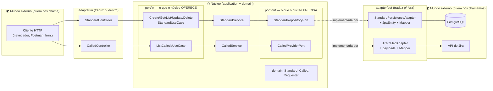
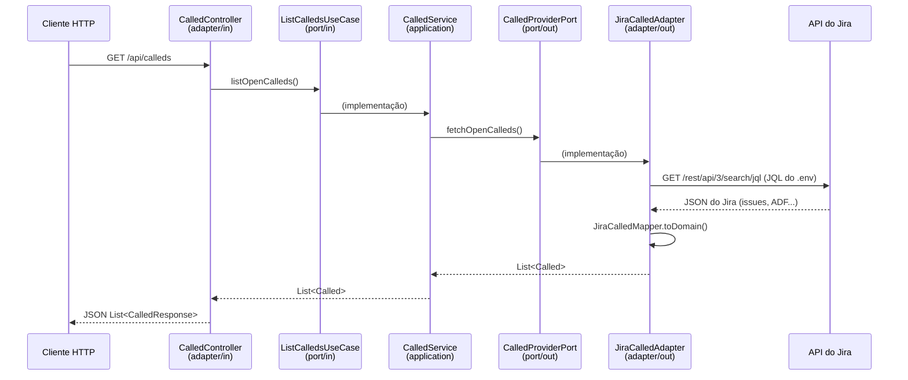

# Arquitetura do knowledgeSupport-api

> Guia de arquitetura para quem vai contribuir, estudar ou evoluir o projeto.
> Leia junto com [FOLDER_STRUCTURE.md](FOLDER_STRUCTURE.md).

## O que o sistema faz

O **knowledgeSupport** é uma base de conhecimento de suporte técnico. A ideia central:

1. Chamados (`Called`) chegam de fora — hoje, puxados da API do **Jira** (projeto SUP).
2. Padrões de erro (`Standard`) são cadastrados e persistidos no **PostgreSQL** — cada um descreve um erro conhecido e sua solução.
3. (Roadmap) O sistema **compara** o chamado com os padrões cadastrados e devolve a solução automaticamente. Quanto mais padrões cadastrados, mais o sistema "aprende".
4. (Roadmap) Integração com **Chatwoot** para receber conversas e responder o solicitante.

## Por que Arquitetura Hexagonal?

O projeto usa **Arquitetura Hexagonal** (Ports & Adapters). O princípio em uma frase:

> **As regras de negócio no centro não sabem COMO o mundo externo fala com elas, nem ONDE os dados são guardados.**

Isso se materializa em duas ferramentas da linguagem:

- **Interfaces (ports)** — contratos que o núcleo declara ("preciso de alguém que salve" / "eu ofereço criar um Standard").
- **Injeção de dependência (Spring)** — quem cumpre cada contrato é decidido fora do núcleo, na inicialização.

O ganho prático: trocar Jira por outro sistema, Postgres por outro banco, ou REST por outro canal **não toca o núcleo** — cria-se/troca-se um adapter.

## O hexágono do projeto



**Como ler:** setas cheias = fluxo de chamada; setas pontilhadas = "quem implementa o contrato". Repare que os dois adapters de saída apontam **para dentro** (implementam interfaces do núcleo) — essa é a **inversão de dependência** que protege o núcleo.

## As três camadas

### 1. `domain` — o vocabulário do negócio

Classes que representam os conceitos do suporte: `Standard` (padrão de erro + solução), `Called` (chamado), `Requester` (solicitante) e os enums (`IncidentType`, `FilterCategory`, ...). **Java puro**: sem Spring, sem JPA, sem JSON. Se um analista de suporte não reconheceria a palavra, ela não pertence a esta camada.

### 2. `application` — as regras e os contratos

- **`port/in`** — interfaces com os casos de uso que o sistema **oferece** (`CreateStandardUseCase`, `ListCalledsUseCase`...). Quem chama: adapters de entrada. Quem implementa: services.
- **`port/out`** — interfaces com o que o sistema **precisa de fora** (`StandardRepositoryPort`, `CalledProviderPort`). Quem chama: services. Quem implementa: adapters de saída.
- **`service`** — a lógica de verdade (`StandardService`, `CalledService`). Orquestra domínio e ports. Também não conhece tecnologia: nenhum import de web, JPA ou HTTP client.

### 3. `adapter` — os tradutores de fronteira

Todo código que fala um "idioma" externo (HTTP, SQL, API do Jira) vive aqui:

- **`adapter/in/web`** — canal REST: controllers + records `*Request`/`*Response` (o formato do **nosso** JSON).
- **`adapter/out/persistence`** — canal banco: `StandardJpaEntity` (formato da tabela), `StandardJpaRepository` (Spring Data) e `StandardMapper`.
- **`adapter/out/jira`** — canal Jira: `JiraCalledAdapter` (REST client), records `Jira*` (formato do JSON **deles**, incluindo ADF) e `JiraCalledMapper`.

## A regra de dependência (a única regra inegociável)

```
adapter  ──pode importar──▶  application  ──pode importar──▶  domain
domain      não importa nada do projeto
application não importa nada de adapter (nem de framework de infra)
```

Na prática, o teste é simples: **abra os imports do arquivo.** Um service com `import jakarta.persistence...` ou um domínio com `import com.fasterxml.jackson...` está violando a arquitetura.

## Por que cada conceito tem "três versões"?

O `Standard` existe como `StandardRequest`/`StandardResponse` (fronteira web), `Standard` (domínio) e `StandardJpaEntity` (fronteira banco). Parece duplicação, mas cada versão pertence a um mundo com motivos próprios para mudar: o JSON da API pode mudar sem quebrar a tabela do banco, e vice-versa. Os **mappers** nas fronteiras fazem a tradução — formatos externos "morrem" dentro do adapter e nunca circulam pelo núcleo.

O mesmo vale para o `Called`: o JSON gigante do Jira (40+ campos, descrição em árvore ADF) vira um `Called` limpo dentro do `JiraCalledMapper`, e o resto do sistema nunca vê um campo do Jira.

## Fluxos reais

### GET /api/calleds (buscar chamados do Jira)



### POST /api/standards (cadastrar um padrão)

```
Cliente ▶ StandardController (StandardRequest → Standard)
        ▶ CreateStandardUseCase ▶ StandardService
        ▶ StandardRepositoryPort ▶ StandardPersistenceAdapter
          (Standard → StandardJpaEntity via StandardMapper) ▶ PostgreSQL
```

## Decisões de arquitetura (e seus porquês)

| Decisão | Motivo |
|---|---|
| `Called` **não é persistido** | O Jira é a fonte da verdade dos chamados. Cada `GET /api/calleds` consulta o Jira ao vivo — sem sincronização, sem dado defasado. |
| `Requester` não tem fatia própria | Ele vive **dentro** do `Called` (parte do agregado). Só ganharia repository/controller se o negócio precisasse gerenciá-lo isoladamente. |
| `CalledController` só tem GET | Chamados nascem no Jira, não na nossa API. |
| Formatos externos ficam nos adapters | JSON do Jira, ADF, entidades JPA: nada disso atravessa uma port. |
| Config sensível via `.env` | Token do Jira e credenciais de banco nunca vão para o git (`.gitignore`). O Spring lê o arquivo via `spring.config.import`. |
| JQL configurável (`JIRA_JQL`) | Mudar o filtro de chamados é configuração, não código. |
| Versionamento automático | Conventional Commits + Release Please. Ver [CONTRIBUTING.md](../CONTRIBUTING.md). |

## Padrões de projeto presentes

- **Ports & Adapters (Hexagonal)** — estrutura geral.
- **Dependency Injection** — Spring instancia e conecta tudo; ninguém dá `new` em dependência.
- **Repository** — `StandardRepositoryPort` abstrai a persistência como uma "coleção".
- **Mapper** — `StandardMapper`, `JiraCalledMapper`: conversão entre representações, sempre na fronteira.
- **DTO** — records `*Request`/`*Response` e `Jira*`: objetos só-dados para atravessar fronteiras.

## Como estender o sistema (receitas)

### Nova operação sobre um conceito existente
1. Crie a interface em `application/port/in` (ex: `AnalyzeCalledUseCase`).
2. Implemente no service (ou crie um service novo).
3. Exponha no controller correspondente.

### Nova integração externa que NÓS chamamos (ex: Chatwoot para enviar mensagem)
1. Crie a port em `application/port/out` (ex: `ChatMessagePort`) — assinatura em termos do domínio.
2. Crie `adapter/out/chatwoot/` com o adapter (`implements ChatMessagePort`), os records do payload e o mapper.
3. Configuração (URL, token) no `.env` + `application.yaml`, injetada via `@Value`.

### Novo canal de entrada (ex: webhook do Chatwoot, scheduler)
1. Crie `adapter/in/chatwoot/` (ou `adapter/in/scheduler/`).
2. O adapter recebe o estímulo externo, traduz para o domínio e chama um use case existente ou novo.
3. O núcleo não muda (a menos que a regra de negócio seja nova).

### Regra de ouro na dúvida
"Quem inicia a conversa?" — algo de fora chama o sistema → `in`; o sistema chama algo de fora → `out`. Direção **da chamada**, não dos dados: *puxar* dados do Jira é `out`, porque somos nós que ligamos para ele.

## Roadmap de arquitetura

- [ ] `AnalyzeCalledUseCase` — cruzar `Called` × `Standard` e sugerir solução (service com duas ports de saída).
- [ ] Campo `jiraKey` e status no `Called` (necessidade de negócio: referenciar o chamado na origem).
- [ ] `adapter/in/chatwoot` (webhook) e `adapter/out/chatwoot` (respostas).
- [ ] Testes de unidade do núcleo com implementações fake das ports (sem banco, sem Jira, sem rede).
